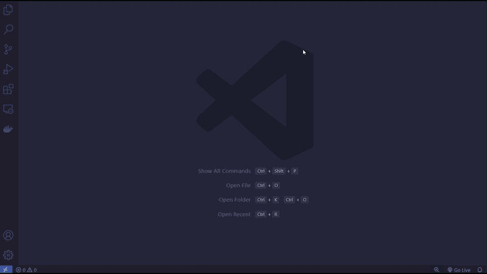

# Key Monkey

A typing test extension for VSCode.

## Getting Started

1. download extension from [Visual Studio Marketplace](https://marketplace.visualstudio.com/vscode)
2. `Ctrl + Shift + P` to open the command palette
3. type `Key Monkey: Start` and hit enter

## Features

- **Word mode**: type a series of words from the most common 1000 english words
- **Quote mode**: type a random quote
- **Timer mode**: type until the timer expires

## Contributions

Pull requests and issues are welcome! Feedback is appreciated!
